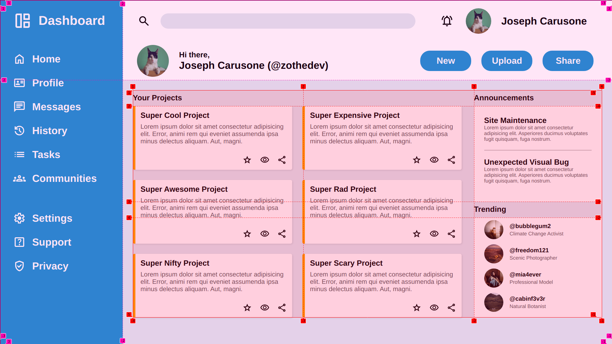
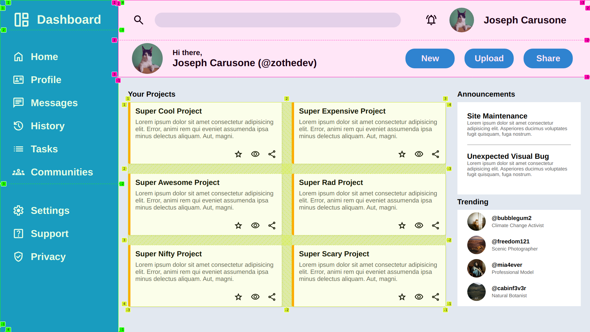
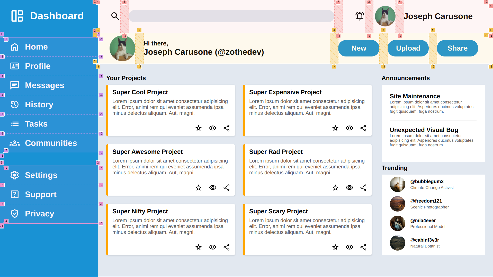

# CSS-Grid-Focussed Admin Dashboard

**NOTE:** This project is specifically built for a 1920x1080 resolution. While responsive design is a critical part of web design, it is not covered until later in [The Odin Projects curriculum](https://www.theodinproject.com/).

In this project, I was tasked with creating an Admin Dashboard layout based off the below design image.

This project is part of the Intermediate HTML/CSS Chapter within [The Odin Projects curriculum](https://www.theodinproject.com/). I was directed to primarily use CSS Grid to layout my content. I used CSS Grid to layout everything with the exception of flexbox for the individual .card elements and .user elements.

My understanding of creating a grid, and then more grids within a grid, is proven with this project. I now have a great understanding of both CSS Grid and CSS Flexbox and how to use them together.

## Project Images:

## Photo Credit:
    
1. [Green-background Cat Picture](https://unsplash.com/photos/black-and-white-cat-lying-on-brown-bamboo-chair-inside-room-gKXKBY-C-Dk?utm_content=creditCopyText&utm_medium=referral&utm_source=unsplash) by [Manja Vitolic](https://unsplash.com/@madhatterzone?utm_content=creditCopyText&utm_medium=referral&utm_source=unsplash) on Unsplash.

2. [Orange Cat Picture](https://unsplash.com/photos/an-orange-cat-sits-on-a-reflective-floor-P_tpT-ee__s?utm_content=creditCopyText&utm_medium=referral&utm_source=unsplash) by [Tianlei Wu](https://unsplash.com/@wutianlei?utm_content=creditCopyText&utm_medium=referral&utm_source=unsplash) on Unsplash.

3. [Desert Landscape Picture](https://unsplash.com/photos/desert-landscape-with-mountains-in-the-background-lIhEJgrU1Ew?utm_content=creditCopyText&utm_medium=referral&utm_source=unsplash) by [Harrison Steen](https://unsplash.com/@pics_by_harry?utm_content=creditCopyText&utm_medium=referral&utm_source=unsplash) on Unsplash.

4. [Posing Woman](https://unsplash.com/photos/a-woman-poses-gracefully-in-a-leather-chair-XeHrK9NgtGE?utm_content=creditCopyText&utm_medium=referral&utm_source=unsplash) by [Mohammad Amin](https://unsplash.com/@aminjl?utm_content=creditCopyText&utm_medium=referral&utm_source=unsplash) on Unsplash.

5. [House sitting in front of Mountains and Waterfalls](https://unsplash.com/photos/a-house-sits-amidst-mountains-and-waterfalls-y28C0M9Mabg?utm_content=creditCopyText&utm_medium=referral&utm_source=unsplash) by [Toni Tan](https://unsplash.com/@tonitan?utm_content=creditCopyText&utm_medium=referral&utm_source=unsplash) on Unsplash.

      